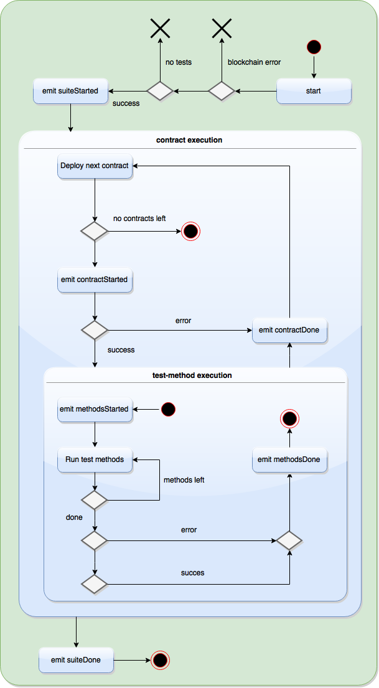

# solUnit

**Disclaimer: Do not download and use. This is not a production ready library. When it is done, it will be announced.** 

2015-07-06: Switched over to our new client. Right now everything seems fine, just got to update the dependencies, which includes the eris-db server, the eris-db.js javascript and the eris-contracts.js which is web3 solidity contracts refitted for eris-db/tendermint. ETA this month (july 2015)**

Running and using this libary is difficult. It is alpha software, and it uses an alpha client to test code written in a language (Solidity) that is still under heavy development.

## Introduction

Unit testing framework for solidity contracts. It runs unit tests and does basic coverage analysis. It uses local solidity compiler (solc) to compile, and the eris-db/tendermint server for carrying out the tests (via its javascript bindings and utilities). 

It used to be based on Ethereum, but switching to our client broke Ethereum compatibility (naturally). This will likely be fixed, hopefully in time for release. Whether or not I will maintain compatibility depends largely on how stable their client and javascript API will be. Technically there's nothing standing in the way.

The name of this library is solUnit, because sUnit is the Smalltalk unit testing framework. Given that sunit or sUnit is easier to write, and that there is no chance of confusion since nobody has used (or unit-tested) smalltalk since the 90s, those aliases are used instead. The node package is called s-unit, which is again just an alias.

## Installing

Only tested on linux (Ubuntu 14.XY).

`npm install s-unit`

Requires cpp-ethereum (latest dev) to function. At the very least it needs the solidity compiler. Instructions for installing can be found here: `https://github.com/ethereum/cpp-ethereum/wiki`. If you're unfamiliar with cpp-ethereum, solidity, or ethereum in general, or are uncomfortable pushing it on latest dev then this tool is not useful.

When Ethereum has been downloaded and installed, check that you are able to run `solc --version` from some directory (doesn't matter which).

**NOTE: You need to keep cpp-ethereum up to date. Always make sure you're on latest dev.**

## Getting started

Easiest is to start looking at the examples in `contracts/src`.

The executable is 'sunit' and allows the following flags:

```
    -h, --help           output usage information
    -V, --version        output the version number
    -c, --coverage       Calculate coverage. Default: is 'false'
    -d, --debugMessages  Get debugging messages. Default: is 'false'
    -r, --rpcUrl         Url to blockchain client. Default is: 'http://localhost:1337'
```

If you install it globally you should get sunit on your path. Try `$ sunit -V` and it should print the version.

You can also run it via 

## Test contract format

The constraints for a unit testing contract right now (0.1.x) are these:

1. Test-contracts must use the same name as the test target but end with `Test`. If you want to test a contract named `Arrays`, name the test-contract `ArraysTest`. If you want to test a contract named `Coin`, name the test-contract `CoinTest`, and so on.

2. Test function names must start with `test`, e.g. `function testAddTwoInts()`, and they must be public. There is no limit on the number of test-functions that can be in each test-contract.

3. The test-contract needs a test event: `event TestEvent(address indexed fId, bool indexed result, uint indexed error, bytes32 message);`. It is used by the framework to validate that a test did indeed pass. The recommended way of doing unit tests is to have the test-contract extend `Asserter`, by importing `Asserter.sol` (comes with the library). Its assertion methods has a proper test event already set up which will fire automatically when an assertion is made. 

NOTE: If none of the existing assertions fit then it is always possible to extend, or to simply calculate the result in the test-function then use `assertTrue` or `assertFalse`.

4. If you want to do coverage analysis, the target contract field must be named `testee`. See example below.

5. Currently, only one assertion/test-event per test method is allowed, and only one `testee` per test contract.

**Example of a simple storage value test with coverage enabled**

```
import "assertions/Asserter.sol";

contract Demo {
    
    uint public x = 0;
    
    function setX(uint _x){
        x = _x;
    }
}

// Test contract named DemoTest as per (1).
contract DemoTest is Asserter {

    uint constant TEST_VAL = 55;

    // We name this contract 'testee' so that we may do coverage analysis.
    // 
    Demo testee = new Demo();
    
    // Test method starts with 'test' and will thus be recognized by solUnit (2).
    function testSetX(){
        
        testee.setX(TEST_VAL);
        var x = testee.x();
        // Use assert method from Asserter contract (3). It will automatically fire of the test event.
        assertUintsEqual(x, TEST_VAL, "Values not equal");
    }
    
}
```

Plenty more in the `contracts/src` folder. It's actually not that hard once solc and eris-db are properly set up. All test contracts looks pretty much the same - a target named 'testee' and a few methods that begin with 'test' with an assertion in it.

### Build constraints

- The `.binary` and `.abi` files for the test contracts must be available in the working directory. Don't need to have the sources there.

- For coverage, the `.ast` file of the test contract, and `.abi` file of the "testee" must be in the working directory as well. 

The easiest way to get it to work is to just compile everything with `--binary file --json-abi file --ast-json file` before running sunit in that folder. It will have all the needed files in there (and then some).

There's a contract build automation script in the gulpfile. It will be more advanced and more standardized with time (and actually use streams...). What it does is basically to copy app sources and external sources (includes) into a temp folder, compile it, move the built files into a build folder and clear the temp. The goal is to eventually have a sane solidity contract build task that can be chained with a unit testing task, so that all the contract stuff can be integrated with the rest of the code. 


## TestEvent and assertions

`TestEvent` is what the framework listens too. It is set up to run test functions, track their names and signatures, then listen to `TestEvent` data from the contract in question. Not having a test event won't break the contract code, but the framework won't be able to tell whether or not the tests succeed. Right now it'll basically just run forever, but adding timeouts is a high priority TODO.

`event TestEvent(address indexed fId, bool indexed result, uint indexed error, bytes32 message);`

The `fId` param is the function id (`msg.sig`) which is passed along to identify the method being called. For technical reasons it uses the `address` type.   

The `result` param is the result of the test. Basically if the assertion succeeded or failed. It's always a boolean.

The `error` param is **not used** right now, but will be used for error/exception handling by allowing error codes to be sent.

The `message` param is used to log a message. This is normally used if the assertion fails. It must be less then 32 bytes.

If the contract extends `Asserter`, it will inherit `TestEvent`, and can also use the assert methods which will automatically trigger the test event. Otherwise you can just roll your own. 

**Example of a bare-bones test contract**
 
```
contract Something(){
    
    int public something;
    
    function setSomething(int _something){
        something = _something;
    }
}

contract SomethingTest {

    event TestEvent(address indexed fId, bool indexed result, uint indexed error, bytes32 message);
    
    Something testee = new Something();
    
    function testSomething(){
        int someValue = 5; 
        testee.setSomething(someValue);
        var intOrSomeSuch = testee.something();
        var result = (intOrSomeSuch == someValue);
        if(result){
            TestEvent(msg.sig, true, 0, "");
        } else {
            TestEvent(msg.sig, false, 0, "Something is wrong.");
        }
    }

}
```

## Examples

The contracts folder comes with a couple of different examples.

## Tests

Cut out most of the tests with the update, as they were ethereum-oriented. Will add new tests gradually. Basic coverage should be done before release.

## Library structure

The framework uses blockchain-client events to do the tests. It uses the afore-mentioned Solidity `TestEvent` to get confirmation from contract methods. To check when the test contracts are deployed it uses a hacky and un-reliable method, but that will be improved when eris-db/tendermint allows it. Basically it listens for new blocks being committed, and checks if there are new transactions in those blocks.

The `SolUnit` class is where everything is coordinated. It deploys the test contracts and publish the results via events. It implements nodes EventEmitter. It also relays some events from dependencies like the `TestRunner` and `Analyzer` (coverage tool).

The `TestRunner` takes a test contract, finds all test methods in it and run those. It also sets up a listener for solidity events, and use those events to determine if tests succeed or fail, and when all the tests has finished. It is normally instantiated and managed by a `SolUnit` object.

The `Analyzer` uses a test contract AST and its targets ABI to determine how many of the methods has been called. It does not look for hidden methods, or how they are called from the public ones, but that will be added later.

In the diagram, the executable would gather tests and set things up, then `SolUnit` would deal with the contract execution section. It defers method execution to the `TestRunner`. The `Analyzer` is not part of this diagram. It is optional, and would run as part of the reporting events to provide additional data. It does not affect the general execution cycle.

Presentation of test data is not part of the diagram either. `SolUnit` does no presentation of its own - it only passes the needed data in the events. The way it works with the command-line tool is it listens to all the events and prints them using a special (winston) logger.

